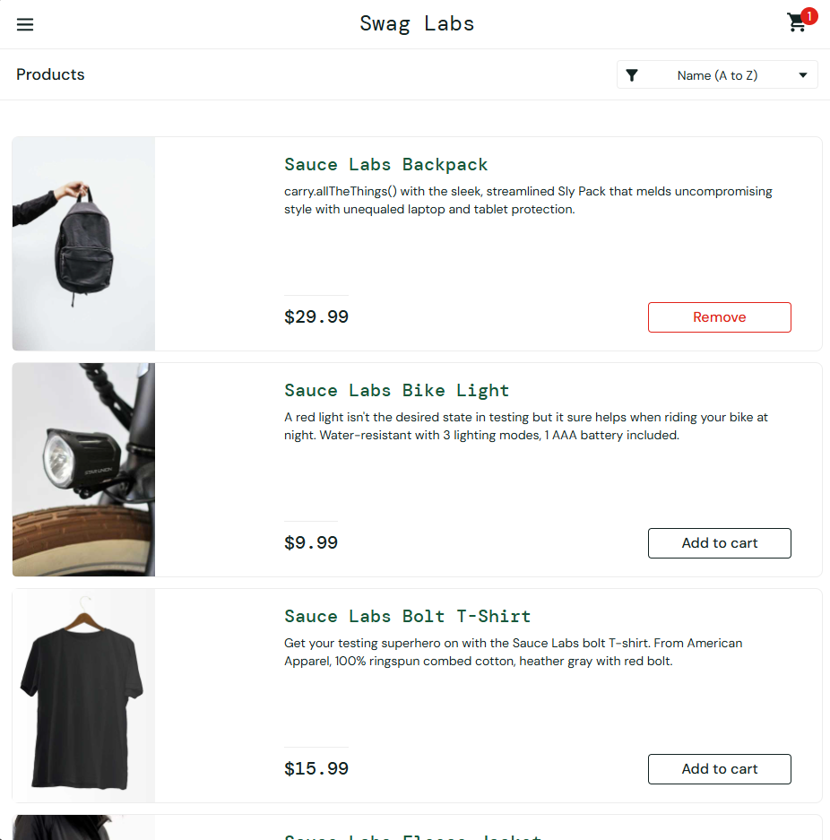
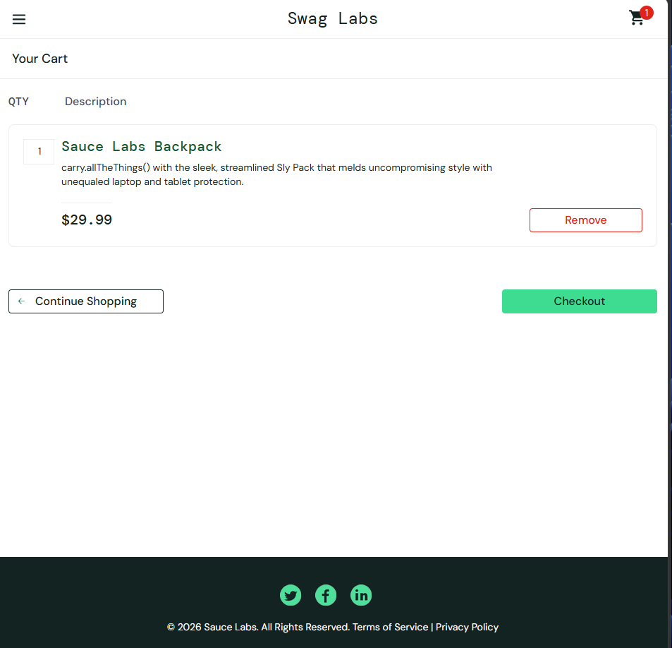
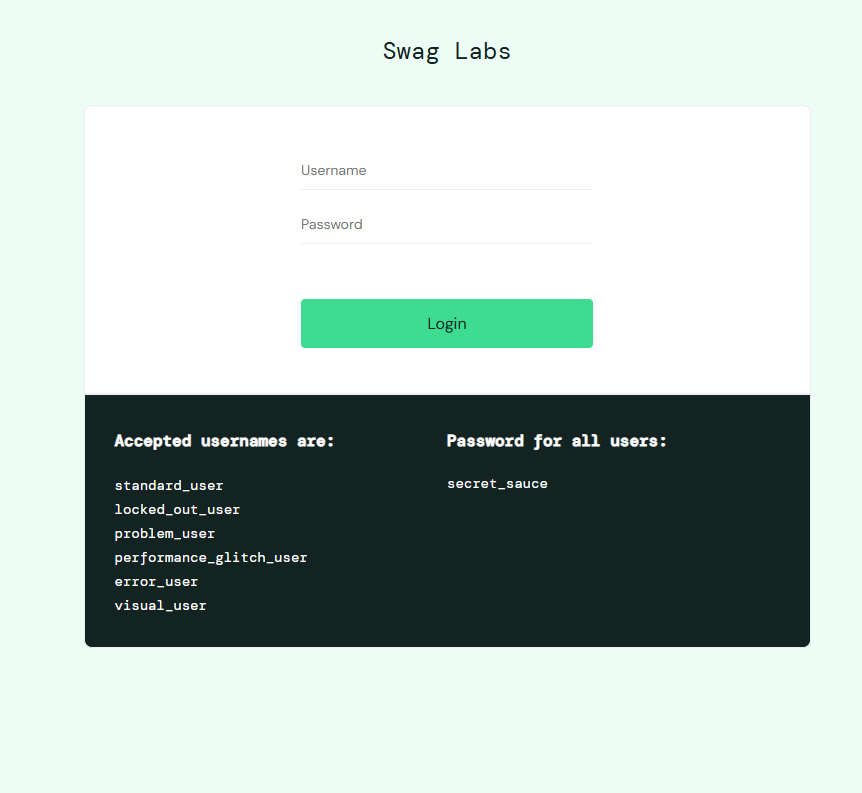
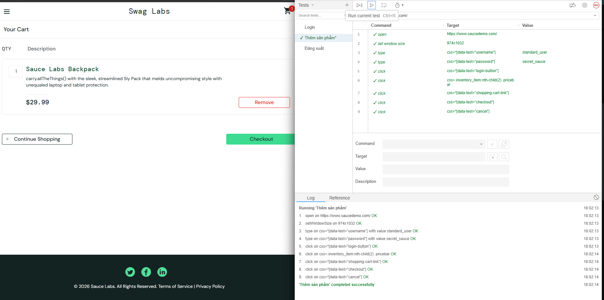

# Lab9_Selenium
# BÁO CÁO BÀI TẬP THỰC HÀNH: KIỂM THỬ TỰ ĐỘNG VỚI SELENIUM

**Thông tin học viên:**
- **Họ và tên:** Trần Quang Tú
- **Mã số sinh viên:** 23017155

---

## 1. Mục tiêu bài thực hành
- Tiếp cận và làm quen với công cụ kiểm thử tự động **Selenium WebDriver**.
- Sử dụng ngôn ngữ lập trình **Python** kết hợp thư viện `unittest` để tổ chức kịch bản kiểm thử.
- Xây dựng thành công tối thiểu 03 test case tự động cho các tính năng cơ bản của website bao gồm: Đăng nhập, Tìm kiếm sản phẩm, và Thêm sản phẩm vào giỏ hàng.

---

## 2. Môi trường và công cụ sử dụng
- **Công cụ sử dụng:** Extensions Selenium EDI
- **Trình duyệt kiểm thử:** Microsoft Edge
- **Website kiểm thử giả lập:** - Tính năng Đăng nhập & Giỏ hàng: `https://www.saucedemo.com/`

---

## 3. Chi tiết các Kịch bản kiểm thử (Test Cases)

### Kịch bản 1: Đăng nhập hệ thống (Login Test)
* **Mục đích:** Kiểm tra tính năng đăng nhập hoạt động đúng khi người dùng nhập đúng tài khoản và mật khẩu hợp lệ.
* **Các bước thực hiện:**
  1. Truy cập vào trang đăng nhập: `https://www.saucedemo.com/`
  2. Tìm ô nhập Username bằng thuộc tính `ID = "Username"` và điền giá trị `"standard_user"`.
  3. Tìm ô nhập Password bằng thuộc tính `ID = "Password"` và điền giá trị `"secret_sauce"`.
  4. Tìm và nhấn vào nút Login bằng `CSS Selector`.
* **Kết quả mong đợi:** Hệ thống hiển thị

### Kịch bản 2: Thêm phần tử/Sản phẩm vào giỏ hàng (Add to Cart Test)
* **Mục đích:** Mô phỏng hành động thêm sản phẩm vào giỏ và xác minh sản phẩm được cập nhật thành công trên giao diện.
* **Các bước thực hiện:**
  1. Truy cập vào trang: `https://www.saucedemo.com/`
  2. Định vị thanh tìm kiếm bằng thuộc tính `Add to cart`.
  3. truy cập vào giỏ hàng xác nhận lại đã có hàng chưa
* **Kết quả mong đợi:** Đã có hàng trong giỏ

### Kịch bản 3: Đăng xuất hệ thống (Logout Test)
* **Mục đích:** Kiểm tra việc đăng xuất có đúng ý người dùng không
* **Các bước thực hiện:**
  1. Truy cập trang: `https://www.saucedemo.com/`
  2. Định vị nút "Logout" bằng cách click vào biểu tượng &#9776; để định vị tới  nút "Logout"
* **Kết quả mong đợi:** Đăng xuất khỏi hệ thống

## 4. Kết quả chạy thử nghiệm
### Kịch bản 1

### Kịch bản 2

### Kịch bản 3
